This is my private knowledge glossary about topics on Machine Learning and Data Science. It is created to give short and summarized descriptions on different topics, solutions and technologies.

The content of this page is going to be extended by time.

#### Table of contents
1. [Machine Learning](#machine-learning)
    - [Decision Tree](#decision-tree)
    - [Random Forest](#random-forest)
    - [Support Vector Machine](#support-vector-machine)
    - [Nearest Neighbor](#nearest-neighbor)
    - [Clustering](#clustering)
    - [Deep Learning](#deep-learning)
    - [Convolutional Neural Networks](#convolutional-neural-networks)
    - [Natural Language Processing](#natural-language-processing)
2. [Data Science](#data-science)
    - [Similarity Measures](#similarity-measures)
    - [Recommendation Systems](#recommendation-systems)
    - [Dimensionality Reduction](#dimensionality-reduction)
    - [Regression Analysis](#regression-analysis)
    - [Naive Bayes Classifier](#naive-bayes-classifier)
    - [Data Warehouse](#data-warehouse)

# Machine Learning
Machine Learning in general is the ability of computer systems to learn patterns and to generalize data. Based on this patterns, it is possible to make decisions and forecast future behavior for unknown data.

Infact Machnine Learning is a collection of various statistical and mathemetical methods to recognize patterns in a dataset. 

Here we differ between three types of Machine Learning problems, based on their learning method (suppervised or unsupervised) and the intention of the Machine Learning system.

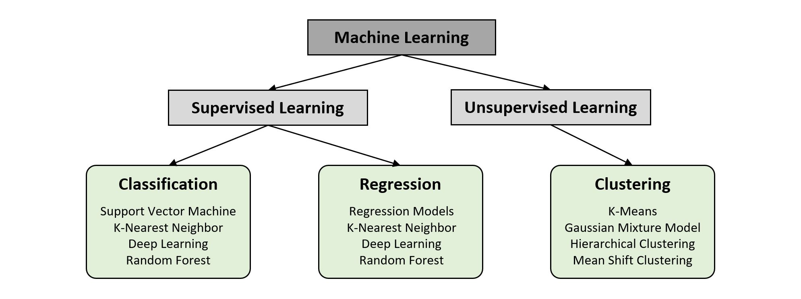

**Classification** is a type of problem where the system predicts **discrete outputs**, like a certain number of classes. Based on its Supervised Learning strategy, the input data has to be pre-labeled.

**Regression** is a type of problem where the system predicts **continuous outputs**, like a certain value of interest. The input data has to be labeles as well, that means it requires a record of data including the value. A common example is the prediction of temperature on the basis of collected weather data.

**Clustering** is a type of problem where the system finds **unknown patterns and groups** in a dataset. It is a kind of explorative data analysis. A common example is categorization of fitting sizes into groups like small, medium, large or extra large. 

## Decision Tree
A Decision Tree is often used for classification and regression problems. It is a structured and directed presentation of certain decision rules. 

The tree consists of different nodes, branches and leafs. To define the nodes, esp. the root node, you have to find a feature that seperates the dataset the best. To find that feature, we make use of the so-called **Gini Impurity**. The lower the Gini Impurity value is, the better the feature seperates the data. 

In this example we want to create a Decision Tree from a small dataset. It should classify datapoints that consists of gender, weight and age into its status of obesity. 

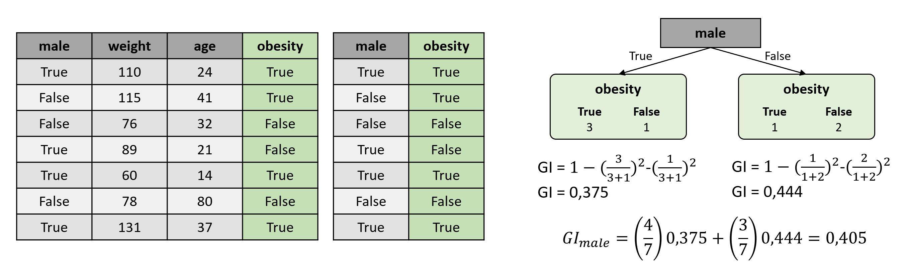

The dataset has three feature and one label column. To build a Decision Tree, we have to find a feature with the lowest Gini Impurity for our data record. The first feature (*male*) is of Boolean Type and easy to handle. You just have to answer the question: How much is obesity dependent from gender? In the figure above, you can see a simple Gini Impurity calculation.

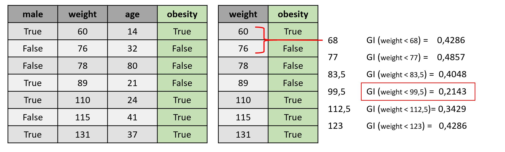

To calculate the Gini Impurity of a non boolean feature like *weight* we have to do a couple of more steps. Firstly, sort the patients by ascending weight. Secondly, calculate the average weight for every adjacent patients. Finally, calculate the Gini Impurity for every average weight and take the lowest to define the Gini Impurity of the feature.

When it comes to ranked or classified data, you have to calculate the Gini Impurity for each combination of classes or rank intervals. 

```python
from sklearn.tree import DecisionTreeRegressor
dt = DecisionTreeRegressor(random_state=1)
dt.fit(train_X, train_y)
```

## Random Forest
A Random Forest is an ensemble of numerous Decision Trees which are randomly build. They are generated from different subsets of the original data which is also called Bootstraped Data. Instead of the entire dataset, these subsets consist of randomly selected features and data rows. The diffenrent subsets lead to *n* different Decision Trees which are combined in ensemble structure of the Random Forest. 

When inserting new data into the Random Forest, it runs the data through every single Decision Tree and takes the **major decision** as output. 

```python
from sklearn.ensemble import RandomForestRegressor
rf = RandomForestRegressor(random_state=1)
rf.fit(train_X, train_y)
```

## Support Vector Machine
A Support Vector Machine is a supervised classification algorithm that tries to find a Hyperplane that seperates the data the best. In a 2-dimensional dataspace the hyperplane is in a straight line with equal distance to the Support Vectors of both classes (margin).

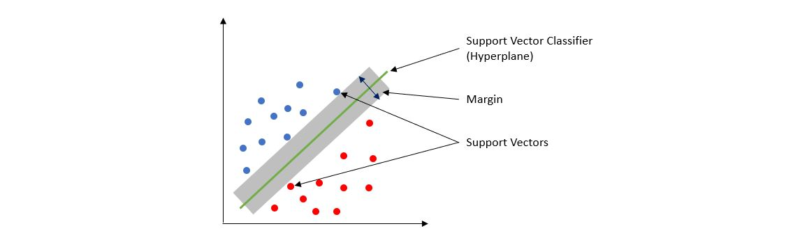

The main idea behind a Support Vector Machine is to start in a relatively low dimension, move the data into a higher dimension and find a Support Vector Classifier that seperates the data into two groups. Therefor, the SVM use Kernel Functions to systemtically find Support Vector Classifiers in higher dimensions. For more information please hava a look on the [StatQuest Video about SVM](https://www.youtube.com/watch?v=efR1C6CvhmE).

```python
from sklearn.svm import SVC
svclassifier = SVC(kernel='linear')
svclassifier.fit(X_train, y_train)
y_pred = svclassifier.predict(X_test)
```

## Nearest Neighbor
This is a very easy supervised algorithm for classification and regression problems. The idea is, to find a number of *k* nearest neighbors (datapoints) in the dataspace and propagate the major or mean result. 


In the example above, the new datapoint finds two points of category C2 and one point of category C3 in its neighborhood. The majority of neighbors belong to category C2 and thus the new datapoint.

```python
from sklearn.neighbors import KNeighborsRegressor
neigh = KNeighborsRegressor(n_neighbors=2)
neigh.fit(X_train, y_train)
neigh.predict(X_test)
```

## Clustering
Clustering is a popular technique to find unknown patterns and groups in dataspace. A common example of clustering algorthms is k-Means Clustering.

**k-Means Clustering** is an unsupervised clustering algorithm that takes a predefined number of clusters (*k*) and repeately performs the last two of the following steps:

- **Initializing:** Choose *k* randomly selected points in the dataspace.
- **Mapping:** Map every datapoint to its nearest cluster. 
- **Updating the center:** Calculate the new means (centroids) of the oberservations in the new cluster.

To find the optimal amount of clusters *k* please have a look on the [Elbow Method](https://pythonprogramminglanguage.com/kmeans-elbow-method/).

```python
from sklearn.cluster import kMeans
kmeans = kMeans(n_clusters=3, init='random', max_iter=10)
kmeans.fit(X_train)
y_pred = kmeans.predict(X_test)
centroids = kmeans.cluster_clusters_
```

## Deep Learning
Deep Learning is Machine Learning disciplin to solve classification and regression problems. It is based on **Artificial Neural Networks**, a complex structure of artificial neurons that. The structure and functionalities of Neural Networks are inspired by the human brain.

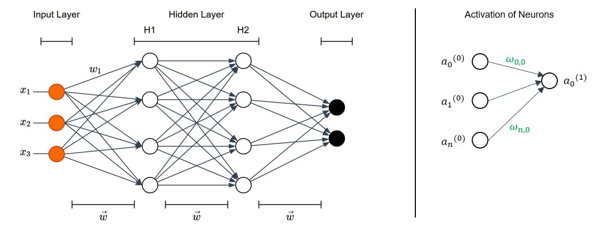

This is a schematic diagram of a very simple Artificial Neural Network. It consists of an Input Layer with three Neurons that represent our data *x*, two Hidden Layer with each four Neurons and an Output Layer with two neurons. An example use case for this network could be a traffic light. Here the Network should evaluate to stop or to go ahead.

Each Neuron *a* is connected with other Neurons on its adjacent layer. These connections have different *strenghts* which are implemented by numeric values called weights *w*. In this example, we see a Fully-Connected Feedforward Network where a Neuron is connected with *all* Neurons on the previous and follwing layer. 

Based on the **weights and biases**, the network produces an output for a set of Input Data. These values are also known as **Hyperparameters**, that have to be trained and optimized on our Train Data. 

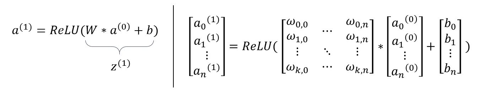

The figure above shows how to calculate the activation of a Neuron. It depends on the previous neruons, connecting weights, biases and on the used **Activation Function**. The choice of the optimal Activation Function is described in the subchapter below. In this case we use the **Rectified Linear Unit (ReLU)**. The entire calculation is based on matrices calculation as shown in the formula. 

The weights and biases are initialized randomly. When we put data to our Input Layer, it results in a certain activation of the neurons on the Output Layer. Now we compare each activation of Neuron on the Ouptput Layer with the result *y* that we want the network to produce. The deviation of the calculated and the actual result is called Error. There are a couple of functions to calculate this error. In the figure below, we use the **Mean Squared Error** as our **Lost Function**. 

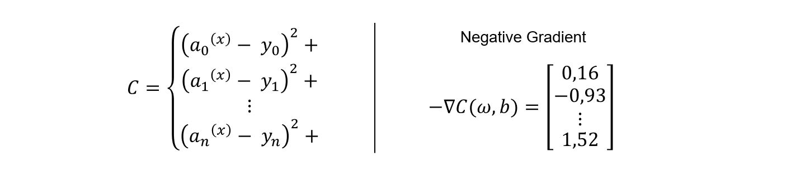

The Error results in a certain numeric value for each training example. After populating more training examples through the Network, we caculate the Average Cost over all calculated errors. The main intent is to reduce this Average Error. If we envision the Cost Function as a multi-dimensional function, the target is to find the global minimum of the function. Therefor, we calculate the **Negative Gradient** to go a stept towards the next local minimum in our multi-dimensional system. 

Infact, we adjust the weights and biases of our network to reduce the average cost. The calculation of the Negative Gradient is called **Back Propagation**. This alogirthm uses derivations and the chain rule to produce a vector of Hyperparameter Changes to adjust the values in our Network.

### Activation Function
The Activation Function reprensents the activation level a neuron. In the past, the most commen Activation Functions were *Sigmoid* and *tanh*. These algorithms are more close to the biological model, but they have a significant problem. They suffer of a **Vanishing Gradient**, that you can see in the fllowing figure:

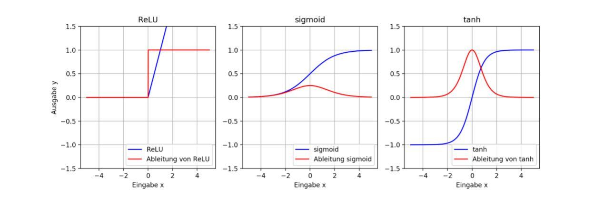

In each plot we see the Activation Function (blue) and its derivation (red). In both right plots we can see, that the gradient (the derivation of the Activation Function) becomes vanishing small. This behavior supresses or even prevents the weight from changing its value, what makes the training more difficult and slower. For this reason, we often make use of the Rectified Linear Unit (ReLU) Activation Function.

There is one particularity when it comes to classification problems with discrete outputs. Here we often use Softmax as the Activation Function for the Output Layer, which brings all activations to a sum of 1. This makes it easier to interprete classification probabilities. 

### Cost Function and Optimization
The Cost Function is used to calculate the difference the calculated activation of the output neurons and the actual result. The Mean Squared Error function ist the most trivial and often used for Regression Problems. When it comes to Classification Problems, (Categorical) Cross-Entropy and Logarithmic Loss are very recommended. To get more information about the implementation, please see this [article about Loss Functions](https://machinelearningmastery.com/loss-and-loss-functions-for-training-deep-learning-neural-networks/).

Additionally, there are some optimization techniques to improve the training. These methods commonly use statistical improvements, momentum and learn rate to empower the gradient adjustment. Here we can mention **Stochastic Gradient Descent (SGD)** and **Adaptive Moment Estimation (Adam)** for instance.


## Convolutional Neural Networks
A Convolutional Neural Network (CNN) is a special type of Neural Networks, which is used to process images in Neural Networks. A CNN consits of at least one **Convolutional Layer** that performs a mathematical convolution of the input matix and a certain number of kernel matrices. The process of convolution is partly visualized in the following figure:

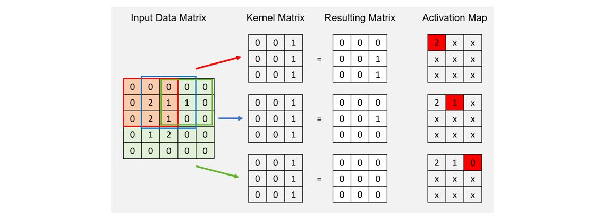

The main idea is, to slide a certain Kernel Matrix over the Input Data Matrix and multiply the values for each single step. Finally, we sum up the values of the resulting matrix and add the bais. This sum is used as an activation level in our Activation Map.

The intent of this operation is to find different representations of the input data. Different representations lead to different **Image Features** like edges, corners, patterns or even almost invisible features. These representations depend on the related kernel matrix and are also called **Activations Maps**.

Depending on the set of convolution parameters, it is also possible to reduce abstract image data and thus reduce the amount of information. In the example above, we reduce a 5x5 Input Matrix into a 3x3 Representation Matrix. Further, it is very popular to string different Convolutional Layer together.

To get a better visualization of the process, please have a look on this [Article about CNNs](https://towardsdatascience.com/a-comprehensive-guide-to-convolutional-neural-networks-the-eli5-way-3bd2b1164a53).


## Natural Language Processing
NLP is a field of AI and a discipline of ML that focuses on the interaction between Data Science and human language and gives machine the ability to read, understand and derive the meaning and sentiment from language. It it used in almost all language-based use cases, like spam recognition, identifying fake news, voice-driven interfaces or even chatbots. The aproach to NLP-problems is always depending on the specific language and use case, but there are several common methods.

**Tokenization**

Tokenization is has the intent to segment and seperate the entire text into single sentences or even single words. This makes it easier to interprete and process the information. Altough it sounds like a trivial task, tokanization leads to some problems when it comes to names, foreign phrases or composed words. 

```python
from nltk.tokenize import sent_tokenize, word_tokenize
text = "This is a simple text. It consists of two sentences."
word_tokens = word_tokenize(text)
sent_tokens = sent_tokenize(text)
```

**Stop Words Removal**

This process is used to reduce the amount of unnecessary data and get rid of common language articles, pronouns and prepositions. 

```python
from nltk.corpus import stopwords
stop_words = set(stopwords.words('english'))
cleaned_word_tokens = [word for word in word_tokens if not word in stop_words]
```

**Stemming**

The idea of stemming is to reduce variations of words with the same meaning to their original stem. It is a sort of normalizing method and cleans the words from tenses and affixes. For example, "write", "written" and "writing" end up into the stem "writ". This improves the further processing due to the reduction of redundant data.

```python
from nltk.stem import PorterStemmer
ps = PorterStemmer()
example_words = ['write','written','writing']
stems = [ps.stem(word) for word in example_words]
```

**Lemmatizing**

This method reduces variation of words to their root word. In contrast to Stemming, which returns the sometimes senseless stem of words. For example, "write", "written" and "writing" results into "write" as the root word.

While using the Lemmatizer from nltk, you further can specify the *Part-of-Speech Constant*. Please see the implementation for abbrevations.

```python
from nltk.stem import WordNetLemmatizer
lemmatizer = WordNetLemmatizer()
print(lemmatizer.lemmatize("rocks")

# ADJ, ADJ_SAT, ADV, NOUN, VERB = a, s, r, n, v
print(lemmatizer.lemmatize("run", pos='v')
```

**Part of Speech Tagging**

As already mentioned in specific Lemmatizing, we can classify each word to their POS (e.g. noun, verb, adjective). To see a list of all types of POS please follow this [link](https://www.ling.upenn.edu/courses/Fall_2003/ling001/penn_treebank_pos.html).

For the implementation we introduce a new sentence takenizer, called PunktSentenceTokanizer. This is an unsupervised learning method which has to be trained in advance. Here we can use any kind of text.

```python
from nltk.corpus import state_union
from nltk.tokenize import PunktSentenceTokenizer
train_text = state_union.raw("2005-GWBush.txt")
sample_text = state_union.raw("2006-GWBush.txt")

tokenizer = PunktSentenceTokernizer(train_text)
tokenized = tokenizer.tokenize(sample_text)
```

**Modelling**

After sanitizing and cleaning the text data, we can use an embedding of the words and its occurences to train a machine learning model. This training can either be supervised (Naive Bayes, RF, DL) or unsupervised (Latent Dirichlet Allocation). 


# Data Science
The challenge behind Data Science is to turn data into information. These information could be used to support business processes with advanced analytics, predictions and decisions. The tasks of a Data Scientist partly overlaps with Machine Learning, but there are still differences between both field of research. 

The work of a Data Scientist could be divided into three segments. 

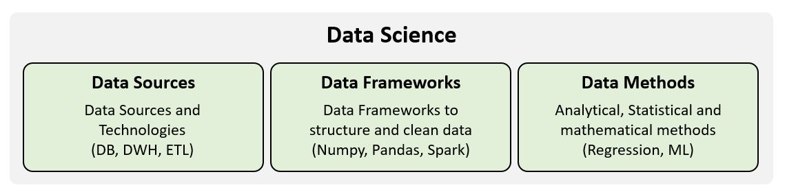

The first segment refers to the variety of **Data Sources and Technologies**. Here you have to identify valid data sources (databases or datastreams) and convert data into a usable structure for further analytics (Data Ware House). In this context Data Scientists make use of ETL-Pipelines (Extract-Transform-Load) to transform and convert data.

The second segment refers to so-called **Data Frameworks** (e.g. Pandas or Apache Spark). These frameworks or libraries provide data structures and methods to handle the data. The selection of an adequate Data Framework is often based on the amount, size and type of data. 

The third segment refers to variety of **analytical, statistical and mathematical methods** which are used by Data Scientists. These methods can range from statistical basics, over regression models to Machine Learning Models. 

## Similarity Measures
An important task in Data Science research is comparing different datapoints with each other to explore similarities and correlations. Here are some major measurement techniques:

### Euclidean Distance (L2-Norm)
The Euclidean Distance is a basic measurement of similarity. For the sake of simplicity, it is the length of the line segment connecting two points in n-dimensional euclidean space. See the following formula to calculate the Euclidean Distance between two points:


The lower the Euclidean Distance, the more similar are the vectors and the datapoints.

### Pearson Correlation
The Pearson Correlation emphasis the similarity and correlation between to vectors or datapoints. It results in a score between -1 (total correlation) and 1 (total positiv correlation). To calculate the Pearson Correlation, we make use of following formula:


```python
from scipy.stats import pearsonr
pearsonr(v1, v2)
```

### Cosine Similarity
The Cosine Simularity is a common used measurement. It calculates the cosine value of the angle between two vectors or datapoints. A consine value of 1 indicates total similarity and a cosine value of -1 indicates total dissimilarity.


```python
from sklearn.metrics.pairwise import cosine_similarity
cosine_similarity(v1, v2)
```


## Recommendation Systems
Recommendation Systems or Recommendation Engines are ML-based systems to recommend a product (or datapoint) based on ratings, content, metadata or user and behavior similarities. At least, you can differ between three types of recommenders. The following examples are related to the IMDB Top 250 dataset, which you can find on [Kaggle](https://www.kaggle.com/rounakbanik/the-movies-dataset).

### Simple Ranking Recommender 
This type on Recommender is is very trivial. The recommendation is based on the rankings given by the users. To make the rankings comparable, you have to calculate the weighted rating for each movie in the dataset. Here we can used the following formula:


Based on the weigthed rankings (see score column in the example), we are now able to recommend best rated movies to the user. 

```python
import pandas as pd
data = pd.read_csv("../data/movies_metadata.csv")

# Number of votes garnered by the 80th percentile movie
m = data.vote_count.quantile(0.80)

# Only consider movies that have more than m votes
movies = data[movies.vote_count >= m]

C = data.vote_average.mean()

def weighted_rating(x, m=m, C=C):
    v = x.vote_count
    R = x.vote_average
    return (v/(v+m) * R) + (m/(m+v) * C)

movies['score'] = movies.apply(weighted_rating, axis=1)

# Sort data by descending score
movies = movies.sort_values('score', ascending=False)
```

### Knowledge Filtering
This type of Recommender uses explicit information given by the user on his favorites. Based on this input you can simply filter the dataset and recommend the movies with the best scores. 

```python
movies = gen_df.copy()
movies = movies[(movies[genre] == 1) &
               (movies.runtime >= low_time) &
               (movies.runtime <= high_time) &
               (movies.year >= low_year) &
               (movies.year <= high_year)]

# Compute the weightes score 
C = movies.vote_average.mean()
m = movies.vote_count.quantile(percentile)

q_movies = movies.copy().loc[movies.vote_count >= m]

q_movies['score'] = q_movies.apply(lambda x: (x['vote_count']/(x['vote_count'] + m) * x['vote_average']) + (m/(m + x['vote_count']) * C), axis=1) 

# Sort movies
q_movies = q_movies.sort_values('score', ascending=False)
```

### Data-based Recommender
This type of Recommender uses descriptions, contents or any other type of meta-information and calculates the similarity between the movies. Based on this similarity scores, the system recommends similar movies to the user.

In the following example we use a set of metadata to create a soup of information that can be compared.

```python
from sklearn.feature_extraction.text import CountVectorizer
from sklearn.metrics.pairwise import cosine_similarity

# Create a metadata soup containing all information we want to take into account
def create_soup(x):
    return ' '.join(x.keywords) + ' ' + ' '.join(x.cast) + ' ' + x.director + ' ' + ' '.join(x.genres)

data['soup'] = data.apply(create_soup, axis=1)
data.soup.head(3)

# Create the recommender with CountVectorizer and cosine_similarity
count = CountVectorizer(stop_words='english')
count_matrix = count.fit_transform(data.soup)

# Compute cosine similarity scores
cosine_sim = cosine_similarity(count_matrix, count_matrix)

# Reset index and construct reverse mapping
data = data.reset_index()
indices = pd.Series(data.index, index=data.title)

# Function that takes the title of a movie as an input for recommendation
def content_recommender(title, cosine_sim=cosine_sim, data=data, indices=indices):
  idx = indices[title]

  # Get the pairwise similarity score of all movies withe that movie
  # Convert it into a list of tuples (position, similarity score)
  sim_scores = list(enumerate(cosine_sim[idx]))

  # Sort the list
  sim_scores = sorted(sim_scores, key=lambda x: x[1], reverse=True)

  # Reduce it to the first 10 movies; Ignore the first (itself)
  sim_scores = sim_scores[1:11]

  # Get the indices
  movie_indices = [i[0] for i in sim_scores]

  # Return the top 10
  return data.title.iloc[movie_indices]

content_recommender('The Lion King')
```

### Collaborativ Filtering


## Dimensionality Reduction
A lot of data and different features have a bad impact on the performance of the training and the model. This is also known as the curse of dimensionality and a big problem in Machine Learning. There are some techniques to reduce the number of dimensions in the data space. This might increase the overall performance of model.

### Principal Component Analysis (PCA)
PCA is an unsupervised feature extraction algorithm and describes the dataset in a limited number of Principle Components. The following description is taken from Wikipedia:

Principal component analysis (PCA) is a statistical procedure that uses an orthogonal transformation to convert a set of observations of possibly correlated variables into a set of values of linearly uncorrelated variables called principal components. This transformation is defined in such a way that the first principal component has the largest possible variance (that is, accounts for as much of the variability in the data as possible), and each succeeding component in turn has the highest variance possible under the constraint that it is orthogonal to the preceding components. The resulting vectors (each being a linear combination of the variables and containing n observations) are an uncorrelated orthogonal basis set.

To sum it up, it combines our input variables in a specific way, then we can drop the “least important” variables while still retaining the most valuable parts of all of the variables. The first PC includes the most variance of the data.

To clarify the process of PCA, please have a look to this [StatQuest Video on PCA](https://www.youtube.com/watch?v=FgakZw6K1QQ).

```python
from sklearn.decomposition import PCA
pca = PCA(n_components)
pca_data = pca.fit_transform(normalized_X)
pca_data = pandas.DataFrame(data=pca_data, columns=['PC1', 'PC2'])

# Get the ratio of variance for each PC
ratios = pca.explained_variance_ratio_
```

## Regression Analysis 
Regression Analysis is a statistical modelling technique to investigate the relationship (correlation) between at least to data variables, the dependent variable (target) and the independent variable (predictor). It can be used for forcasting, time series modelling and finding a causal realtionship. 

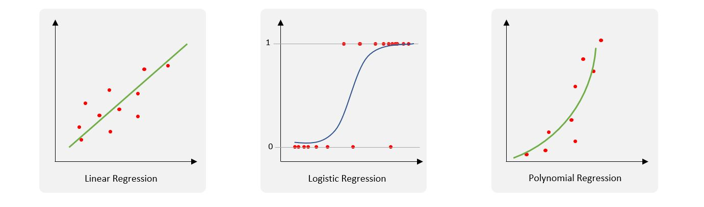

There are a lot of different Regression Models, so lets take a look on the three most common types.

**Linear Regression** finds the best fit straight line (regression line) between the dependent and independent variable.

**Logistic Regression** is used when the dependent variable is binary (0,1). This method is widely used for classification problems.

**Polynomial Regression** is used when the power of the independent variable is more than 1. 

```python
from sklearn.linear_model import LinearRegression
regression = LinearRegression()
regressor.fit(X_train, y_train)
```

## Naive Bayes Classifier
Naive Bayes probabilistic machine learning method which is mostly used for classification tasks. It is based on the Bayes Theorem, as shown in the following figure:

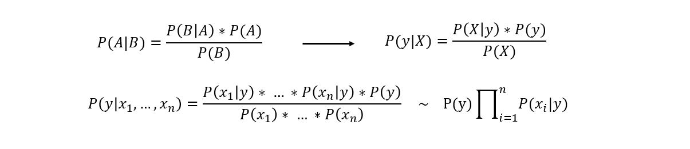

Imagine we have a data structure with a set of **independent** features and a column with assigned values of classification. To transfer this information to our Naive Bayer Classifier, we define *y* as our class variable and *X* as our set of features. Now we can calculate each of the components with a look on our data set. There are at leat three types of Naive Bayes Classifiers to differ. 

The **Multinomial Naive Bayes** is mostly used for document classification problem. A good example is the classification of text into categories of plotics, sports, technology, etc. The features could be the frequency of words in the text.

The **Bernoulli Naive Bayes** is similar to the Multinomial one but the features are boolean variables. For example, wether a words occurs in a text or not.

The **Gaussian Naive Bayes** is prefered, when the features are continuous values. We assume that they are sampled from a Gaussian Distribution.

```python
from sklearn.naive_bayes import GaussianNB
gnb = GaussianNB()
gnb.fit(X_train, y_train)
pred = gnb.predict(X_test)
```


## Data Warehouse 
A DWH is a centralized database system that is used to consolidate data from different data sources in order to run complex analytics on a single point of truth. It is often implemented in a cloud computing infrastructure and based on **Online Analytical Processing (OLAP)**. 

OLAP is an approach to handle multi-dimensional analytical data queries that is mostly optimized for read actions. It is contrasted to Online Transactional Processing (OLTP), which is characterized by much less complex queries, in a larger volume and in order run database transactions. 

Compared to a nomal database that is designed to record data, a DWH is designed to analyse data. The key difference is the size of storage and the query latency. Furthermore the data of a DWH is often denormalized and thus easier to join.

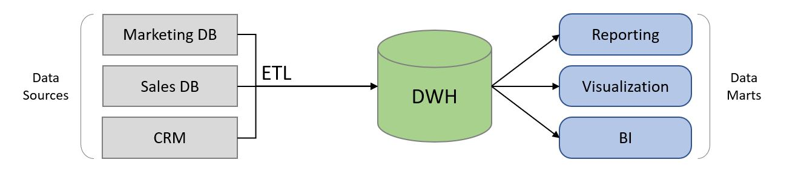

The process of transfering data from different data sources to the DWH is used to be implemented with the help of **ETL-Pipelines** (Extract, Transform, Load). Please see the following sub-chapter for more information about ETL-Pipelines.

Common providers of DWH solutions are Amazon Redshift, TerraData, Oracle and Pentaho.

### ETL-Pipelines 
ETL is a process to transform and consolidate heterogene data from different source into a target database or DWH. This process is based on three main steps: Extraction, Transformation and Loding. 

**Extraction** of data is the first step. Here we load data from different sources and of different structure into the working environment. There are different strategies to handle new data changes that can be divided into synchronical and asynchronical extraction. Synchronical extraction means that every change in the data source is instantly propagated to DWH (Real-time Data Warehousing). For asynchronical extraction we can extract data periodicly, event-based or on-demand. 

The **Transformation** of data that we extracted before, is the next step. This sub-process happens in a special environment, which is called the Staging Area. Here we clean and sanitize our data and bring it into a scheme, that can be joined with the data in our DWH. We differ between syntactical transformations (e.g. format transformation) and semantical transformations (e.g. key definition or normalization).

**Loding** is the finals step of ETL-process. The we convert the data into the required type or format. Depending on the target, this can vary from simple csv structures to complex file systems.

Especially due to the last point of complex file formats for DWHs, it is recommended to use special tools for ETL-Pipelining. Further advantages are performance, easy development and maintenance. Well-known providers for ETL-tools are Kettle Pentaho Data Integration or Xplenty. 


