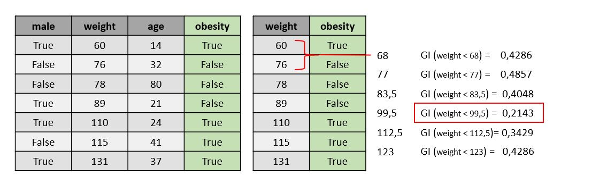

This is my knowledge glossar about topics on Machine Learning and Data Science. I use it for myself to recapture different topics, dicscriptions, solutions and technologies. 

#### Table of contents
1. [Machine Learning](#machine-learning)
2. [Data Science](#data-science)

# Machine Learning
Machine Learning in general is the ability of computer systems to learn patterns and to generalize data. Based on this patterns, it is possible to make decisions and forecast future behavior for unknown data.

Infact Machnine Learning is a collection of various statistical and mathemetical methods to recognize patterns in a dataset. 

Here we differ between three types of Machine Learning problems, based on their learning method (suppervised or unsupervised) and the intention of the Machine Learning system.


**Classification** is a type of problem where the system predicts **discrete outputs**, like a certain number of classes. Based on its Supervised Learning strategy, the input data has to be pre-labeled.

**Regression** is a type of problem where the system predicts **continuous outputs**, like a certain value of interest. The input data has to be labeles as well, that means it requires a record of data including the value. A common example is the prediction of temperature on the basis of collected weather data.

**Clustering** is a type of problem where the system finds **unknown patterns and groups** in a dataset. It is a kind of explorative data analysis. A common example is categorization of fitting sizes into groups like small, medium, large or extra large. 

## Decision Tree
A Decision Tree is often used for classification and regression problems. It is a structured and directed presentation of certain decision rules. 

The tree consists of different nodes, branches and leafs. To define the nodes, esp. the root node, you have to find a feature that seperates the dataset the best. To find that feature, we make use of the so-called **Gini Impurity**. The lower the Gini Impurity value is, the better the feature seperates the data. 

In this example we want to create a Decision Tree from a small dataset. It should classify datapoints that consists of gender, weight and age into its status of obesity. 


The dataset has three feature and one label column. To build a Decision Tree, we have to find a feature with the lowest Gini Impurity for our data record. The first feature (*male*) is of Boolean Type and easy to handle. You just have to answer the question: How much is obesity dependent from gender? In the figure above, you can see a simple Gini Impurity calculation.



To calculate the Gini Impurity of a non boolean feature like *weight* we have to do a couple of more steps. Firstly, sort the patients by ascending weight. Secondly, calculate the average weight for every adjacent patients. Finally, calculate the Gini Impurity for every average weight and take the lowest to define the Gini Impurity of the feature.

When it comes to ranked or classified data, you have to calculate the Gini Impurity for each combination of classes or rank intervals. 

```python
from sklearn.tree import DecisionTreeRegressor
dt = DecisionTreeRegressor(random_state=1)
dt.fit(train_X, train_y)
```

## Random Forest
A Random Forest is an ensemble of numerous Decision Trees which are randomly build. They are generated from different subsets of the original data which is also called Bootstraped Data. Instead of the entire dataset, these subsets consist of randomly selected features and data rows. The diffenrent subsets lead to *n* different Decision Trees which are combined in ensemble structure of the Random Forest. 

When inserting new data into the Random Forest, it runs the data through every single Decision Tree and takes the **major decision** as output. 

```python
from sklearn.ensemble import RandomForestRegressor
rf = RandomForestRegressor(random_state=1)
rf.fit(train_X, train_y)
```

## Support Vector Machines
## k-Nearest Neighbor
## k-Means Clustering
## Deep Learning
## Convolutional Neural Networks
## Reinforcement Learning
## Natural Language Processing


# Data Science
The challenge behind Data Science is to turn data into information. These information could be used to support business processes with advanced analytics, predictions and decisions. The tasks of a Data Scientist partly overlaps with Machine Learning, but there are still differences between both field of research. 

The work of a Data Scientist could be divided into three segments. 


The first segment refers to the variety of **Data Sources and Technologies**. Here you have to identify valid data sources (databases or datastreams) and convert data into a usable structure for further analytics (Data Ware House). In this context Data Scientists make use of ETL-Pipelines (Extract-Transform-Load) to transform and convert data.

The second segment refers to so-called **Data Frameworks** (e.g. Pandas or Apache Spark). These frameworks or libraries provide data structures and methods to handle the data. The selection of an adequate Data Framework is often based on the amount, size and type of data. 

The third segment refers to variety of **analytical, statistical and mathematical methods** which are used by Data Scientists. These methods can range from statistical basics, over regression models to Machine Learning Models. 

## Recommendation Systems
Recommendation Systems or Recommendation Engines are ML-based systems to recommend a product (or datapoint) based on ratings, content, metadata or user and behavior similarities. At least, you can differ between three types of recommenders. The following examples are related to the IMDB Top 250 dataset, which you can find on [Kaggle](https://www.kaggle.com/rounakbanik/the-movies-dataset).

### Simple Ranking Recommender 
This type on Recommender is is very trivial. The recommendation is based on the rankings given by the users. To make the rankings comparable, you have to calculate the weighted rating for each movie in the dataset. Here we can used the following formula:

FORMEL Weighted rating with description

Based on the weigthed rankings (see score column in the example), we are now able to recommend best rated movies to the user. 

```pyhton
import pandas as pd
data = pd.read_csv("../data/movies_metadata.csv")

# Number of votes garnered by the 80th percentile movie
m = data.vote_count.quantile(0.80)

# Only consider movies that have more than m votes
movies = data[movies.vote_count >= m]

C = data.vote_average.mean()

def weighted_rating(x, m=m, C=C):
    v = x.vote_count
    R = x.vote_average
    return (v/(v+m) * R) + (m/(m+v) * C)

movies['score'] = movies.apply(weighted_rating, axis=1)

# Sort data by descending score
movies = movies.sort_values('score', ascending=False)
```


